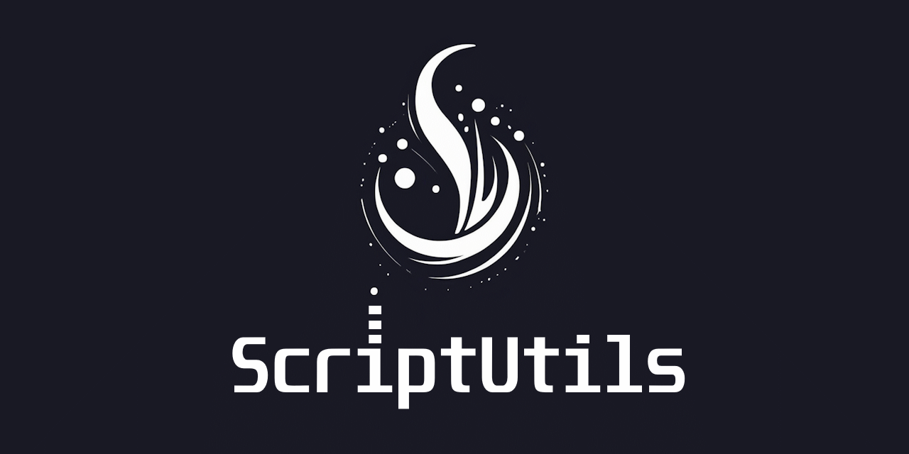

ScriptUtils package is helper library that contains the scripts used across the Unity projects. These are primarily Python and Windows batch (.cmd/.bat) files designed to automate and streamline development workflows.

## 📁 Structure

```
UserProject/ 
├─UserScripts/    
└─ScriptUtils/ 
  ├── Core/       
  ├── UserScriptsExamples/    
  └── Config/
```

## 📂 Folder Descriptions

*Core/* 
Contains the core logic and implementation of helper utilities. These modules are not intended to be executed directly but are used as building blocks for scripts in the Scripts/ folder.

*UserScripts/*
Contains user-executable scripts. These typically serve as entry points and are composed by combining and calling logic from the Core/ directory. Each script solves a specific task like project setup, builds, cleaning temporary files, importing assets to Unity, etc. This folder is under source control of root project.

*UserScriptsExamples/*
Contains user-executable scripts examples.

*Config/*
Stores user- or machine-specific settings and environment variables. Useful for maintaining local configuration without affecting shared scripts.

## Folder Usage Recap
✅ UserScripts - Real, production-ready entry point scripts (under source control)
📌 All paths in scripts should be interpreted relative to: UserProject folder (example: d:\projects\dev\UserProject). This is considred as a root folder of the project.


## Utilities

- BackupUtil 
- PromptWithContextUtil
- UdioUtil
